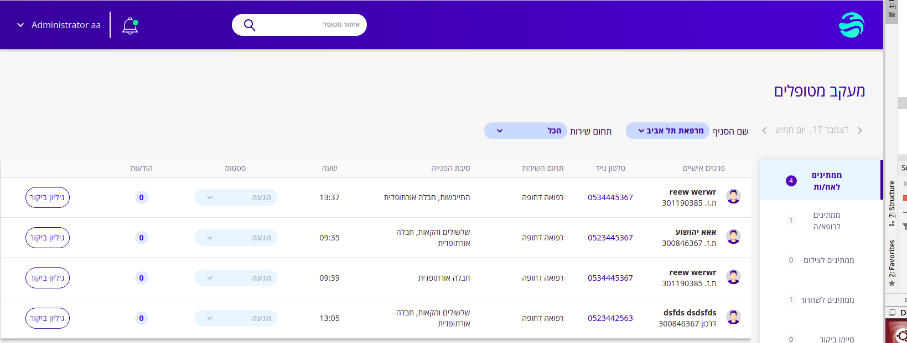

# Required settings for starting 

## Create new clinic
Clinikal supports working with multiple facilities. before starting you must create at least one clinic.
How to create clinic:  
1.Go to **Administration** -> **Clinic** -> **Facilities**   
Add new Facility:  
Required parameters -  

| **Field**      | **value**      |
| -------------------------- | -------------- |
| Name                       |   any             |                                                                                       
| Billing Location           | true           |
| Service Location           | true           |
| POS Code                   | 11:Office      |


2. Manual step (currently), for Fhir API need to run SQL query in the database:  
Find the id of the facility you just added:
```
SELECT id FROM `facility` WHERE name = '<YOUR NAME>';
```
Then run this query (replace \<ID OF FACILITY\> with the result from above query)
```
INSERT INTO `fhir_healthcare_services` (`active`, `providedBy`, `category`, `type`, `name`) VALUES (1, <ID OF FACILITY>, 30, 1, <NAME OF FACILITY>);
``` 
This query sets the facility as [healthcare service](https://www.hl7.org/fhir/healthcareservice.html).

3.When you create new user do not forget to save "Default Facility" from your clinics list (mandatory).

 
## Add HMOs

In Clinikal every patient must be member in a health maintenance organization.  
How to create HMO:  
1.Go to **Administration** -> **Clinic** -> **Facilities**   
Add new Facility:  

Required parameters -

| **Field**                           | **value**                                                                                                                                                                                             |
| -------------------------------------- | -------------- |
| Name |           any                                                                                                                                    |
| POS Code                            | 71:Public Health Clinic |


#### Login into Clinikal - Enjoy!!
 