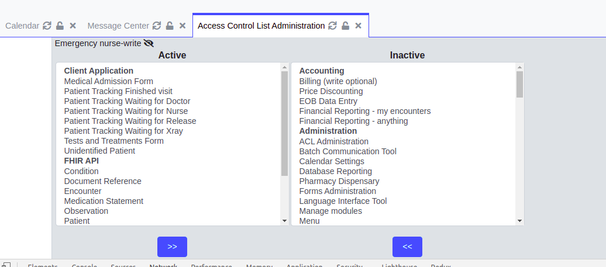

## Backend  - start development

The backend code contains a set of utilities that extend the OpenEMR code and enable us to develop new features quickly.  
All the utilities found in the [clinikal-backed]() repository and divided into different ZF modules  according to the scope.

*  _Generic-tools_ - contains some services, contollers, models and helper are in used in several modules.
  
*  _Cliikal-api_ - contains utilities are needed for the backend of React project.
  
*  _Fhir-api_ - contains models, contlllers and services for Fhir API.

In this document we review the main utilities you can find in the Generic-tools modules, we hope it gives you a good starting point to start a new development.  

###Controllers and models
As we've mentioned all the backend code developed in the ZF modules. 
Before you begin with clinikal we recommend starting a basic knowledge about the structure and functionalities in the [Laminas/MVC project](https://docs.laminas.dev/mvc/).  

**Controllers**  
_Base controller_ - `GenericTools\Controller\BaseController` - the BaseController contains all the common functionality that needed in all the project (e.g. quick access to database models and more), the best practice is to inherit it in every controller.  

**Models**  
We supply set of Models and Table gateways for database connection according to [laminas-db](https://docs.laminas.dev/laminas-db/) principles.  
Most table gateways using trait `\GenericTools\Model\baseTable` for creating complex queries clearly and quickly.  
**List of available models:** (GenericTools/src/GenericTools/Model)  
AclTables  
Documents  
Facility  
FormEncounter  
FormVitals  
Languages  
Lists  
Log  
Patient  
Prescriptions  
Users  
And more...  

###Serivces
The following powerful services enable us quick integration with several useful tools.   
**Pdf**  
Generate PDF file, render html for pdf using [Laminas Rendering Views](https://docs.laminas.dev/laminas-view/php-renderer/).  
usage example:  
```
$viewTemplate = 'report-tool/pdf/report-pdf';
$viewParams = [
    'title' => $title,
    'data' => $data,
    'columns' => $columns
];
$this->container->get(PdfService::class)->fileName($fileName);
$this->container->get(PdfService::class)->setStandardHeaderFooter();
$this->container->get(PdfService::class)->body($viewTemplate,$viewParams);
$this->container->get(PdfService::class)->render();
```
**Mail**  
Send Email    render html for pdf using [Laminas Rendering Views](https://docs.laminas.dev/laminas-view/php-renderer/).
```
$htmlTemplate  ='patients/alert/email';
$this->container->get(MailService::class)->subject($subject);
$this->container->get(MailService::class)->priority(1);
$this->container->get(MailService::class)->body($htmlTemplate, $bodyParams);
//attach pdf (optionaly)
$this->container->get(MailService::class)->attach($stringIOPDF, 'binary', 'symptoms_' . $patient->fname . '_' . $patient->lname . '_' . date("Y_m_d").'.pdf', 'application/pdf');
$status = $this->container->get(MailService::class)->send($mailList);
```
**S3**  
Upload and download file from s3, integration with API's modules.
requirements:  
- Environment variables with access and secret keys
- [connection details](../get_started/documents_storage.md)
usage example:  
```
$s3Service = new S3Service($this->getContainer());
$s3Service->connect();
$data = $s3Service->fetchObject($fullUrl);
```
**SSE**    
[Server-sent events](https://en.wikipedia.org/wiki/Server-sent_events) implementation  
usage example:  
```injectablephp
public function patientsTrackingCheckRefresh($facility_id)
{
    $cptcTable=$this->container->get(ClinikalPatientTrackingChangesTable::class);
    $date=$cptcTable->getLastUpdateDate($facility_id);
    $sse = new SseService($cptcTable,'getLastUpdateDate',$facility_id);
    $sse->connect();
    return array();
}
```
**Couchdb**  
Upload and download file from CouchDB, full integration with OpenEMR document system.
usage example:  
```injectablephp
$couchdbService = new CouchdbService($this->getContainer());
$couchdbService->connect();
$document = $couchdbService->fetchDoc($couchDocId, false);
```
**Ecxel**  
Generate excel file.  
usage example:  
```injectablephp
$excelService = $this->container->get(ExcelService::class);
$excelService = $this->getExcelService();
$excelService->setColumnsNames($columnsName);
$excelService->setData($data);
$excelService->setTabTitle($tabTitle);
$excelService->fileName($fileName);
$excelService->downloadFile();
```

###Report tool
The [ReportTool](https://github.com/israeli-moh/clinikal-backend/tree/develop/modules/ReportTool) module contains infrastructure for generate reports, the reports tool supply UI with pagination, print report as PDF and export the report to excel file.  

**How to adding a new report?**  
Every report need -   
1. new class extends the `ReportTool\Controller\BaseController` and implements ReportInterface    
   ```
   class ReportContrller extends ReportBase implements ReportInterface
   ``` 
2. New SQL Stored Procedure the fetch the data for the report and get the filters as arguments.    
3. new routing in the <YOUR MODULE>/config/module.config.php   
4. link to route from [OpenEMR json menus](https://www.open-emr.org/wiki/index.php/Role_Based_Menus).      

The report will show in the OpenEMR interface and not in the React view.  

For example you can take a look on the Encounetrs report in the [vertical-emergency-medicine-backend repository](https://github.com/israeli-moh/vertical-emergency-medicine-backend)

*  [Controller](https://github.com/israeli-moh/vertical-emergency-medicine-backend/blob/develop/modules/EmergencyMedicine/src/EmergencyMedicine/Controller/EncounterReportContrller.php)
   
*  [Stored Procedure](https://github.com/israeli-moh/vertical-emergency-medicine-backend/blob/develop/modules/EmergencyMedicine/sql/install.sql#L321)
   
*  [Routing](https://github.com/israeli-moh/vertical-emergency-medicine-backend/blob/develop/modules/EmergencyMedicine/config/module.config.php#L71) and [Menu](https://github.com/israeli-moh/vertical-emergency-medicine-backend/blob/develop/menus/clinikal-emergency.json#L1318)  

###Import data
The [import data](https://github.com/israeli-moh/clinikal-backend/tree/develop/modules/ImportData) tool helps you to import lists into the database from CSV files with minimum configuration.
The mechanism enables to import to list_options table or codes table.
We have [set of lists](https://github.com/israeli-moh/clinikal-backend/tree/develop/modules/ImportData/src/ImportData/Lists) already mapped in to the database, and you can add additional lists as you needed.  
**What do you need to mapping a new list?**  
1. CSV file with your records, the separator between the columns must be | (pipe).  
2. Create a new list class that extends BaseList implements InterfaceList.  
in this class you need to map between the csv columns to the database table.  
3. register the new list in the database -  
```injectablephp
INSERT INTO `moh_import_data` (`id`,`external_name`,`clinikal_name`,`static_name`,`source`,`update_at`) VALUES 
(1,'<FILE_NAME>','<LIST_NAME>','<STATIC_NAME>','CSV','2035-03-02 09:09:32');
```

##OpenEMR modules managing
OpenEMR provides [customization and extension using Zend modules](https://www.open-emr.org/wiki/index.php/Creating_Modules), the modules can be configured and controlled in the "managing modules" screen (modules -> managing modules).  
In the managing screen possible to register and enable modules and run of SQL and ACL upgrade processes.


In the installation process of new module the file `sql/install.sql` run with the changes that needed in the database, in addition the file `acl/acl_setup.php` run with the new ACL configurations (more details in the next section).

##SQL upgrade file
Every module has a internal version file (`Module/version.php`).   
The versions needed for SQL and ACL upgrade with safe migration between the version.    
The upgrade files are written according to [OpenEMR principles](https://www.open-emr.org/wiki/index.php/Upgrade_Mechanism) and running with the OpenEMR mechanism.    
For example, if the version in the file is 2.5.0, you need to create file `2_5_0-to-3_0_0_upgrade.sql` for the queries of the next version.  

**Examples of sql upgrade blocks**   
Create new table:  
```injectablephp
#IfNotTable encounter_reasoncode_map
CREATE TABLE encounter_reasoncode_map (
eid INT(6) UNSIGNED,
reason_code  INT(6) UNSIGNED
);
#EndIf
```

Update recodes with conditions:
```injectablephp
#IfNotRow3D fhir_validation_settings fhir_element Encounter filed_name status validation blockedEncounter
UPDATE `fhir_validation_settings` SET `validation` = 'blockedEncounter' WHERE
`fhir_element` = 'Encounter' and `filed_name` = 'status'AND `validation` = 'blockedIfValue';
#EndIf
```

Add column to table:
```injectablephp
#IfMissingColumn lists diagnosis_valueset
ALTER TABLE `lists` ADD `diagnosis_valueset` VARCHAR(255) NULL AFTER `diagnosis`;
#EndIf
```

##ACL managing
Clinikal comes with extensive Access Control System that based on [OpenEMR ACL](https://www.open-emr.org/wiki/index.php/Access_Controls_Listing).    
In our modules we create new Access roles, sections and objects according to the clinic type (e.g. the imaging clinic needed X-ray technician what that not needed in the other clinics).    
The settings of the ACL are written in every module in the `acl` folder in the `acl_setup.php` and `acl_upgrade.php` and use functions from class `OpenEMR\Common\Acl\AclExtended` for the configurations.  

**Example of useful ACL functions**  
Add new role (nurse for emergency center with view permission):  
```injectablephp
$emergency_nurse_view =AclExtended::addNewACL('Emergency nurse', 'emergency_nurse', 'view', 'Things that emergency nurse can read but not modify');
```
new ACL object for Encounter report:
```injectablephp
AclExtended::addObjectAcl('client_app', 'Client Application', 'EncountersReport','Encounters Report');
```

Allow nurse to show Encounter report:
```injectablephp
AclExtended::updateAcl($emergency_nurse_view, 'Emergency nurse', 'client_app', 'Client Application', 'EncountersReport','Encounters Report', 'view');
```

The ACL setting can be modified in the administration interface of OpenEMR - _Administration -> ACL_



