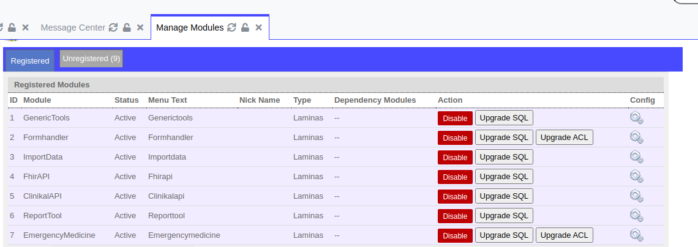

##OpenEMR modules managing
OpenEMR provides [customization and extension using Zend modules](https://www.open-emr.org/wiki/index.php/Creating_Modules), the modules can be configured and controlled in the "managing modules" screen (modules -> managing modules).  
In the managing screen possible to register and enable modules and run of SQL and ACL upgrade processes.


In the installation process of new module the file `sql/install.sql` run with the changes that needed in the database, in addition the file `acl/acl_setup.php` run with the new ACL configurations (more details in the next section).   

##SQL upgrade file
Every module has a internal version file (`Module/version.php`).  
The versions needed for SQL and ACL upgrade with safe migration between the version.  
The upgrade files are written according to [OpenEMR principles](https://www.open-emr.org/wiki/index.php/Upgrade_Mechanism) and running with the OpenEMR mechanism.  
For example, if the version in the file is 2.5.0, you need to create file `2_5_0-to-3_0_0_upgrade.sql` for the queries of the next version.  

**Examples of sql upgrade blocks**   
Create new table:  
```injectablephp
#IfNotTable encounter_reasoncode_map
CREATE TABLE encounter_reasoncode_map (
eid INT(6) UNSIGNED,
reason_code  INT(6) UNSIGNED
);
#EndIf
```

Update recodes with conditions:
```injectablephp
#IfNotRow3D fhir_validation_settings fhir_element Encounter filed_name status validation blockedEncounter
UPDATE `fhir_validation_settings` SET `validation` = 'blockedEncounter' WHERE
`fhir_element` = 'Encounter' and `filed_name` = 'status'AND `validation` = 'blockedIfValue';
#EndIf
```

Add column to table:
```injectablephp
#IfMissingColumn lists diagnosis_valueset
ALTER TABLE `lists` ADD `diagnosis_valueset` VARCHAR(255) NULL AFTER `diagnosis`;
#EndIf
```